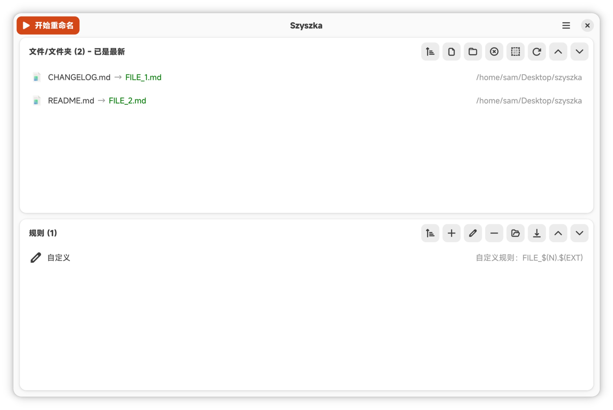

# Szyszka

<div align="center">
  
</div>

Szyszka is a simple but powerful and fast bulk file renamer.

## Features
- Great performance (multithreaded file search via `rayon`/`jwalk`)
- Available for Linux, Mac and Windows
- Modern GUI built with GTK 4 and libadwaita (GNOME HIG compliant)
- Add files and folders by browsing, dragging and dropping, or via the command line
- Multiple rules which can be freely combined:
  - Replace text (supports regular expressions)
  - Trim text
  - Add text
  - Add numbers (including per-folder counters)
  - Purge text
  - Change letters to upper/lowercase
  - Normalize unicode/whitespace
  - Custom rules (macro parser with optional numbers)
- Save rules to be able to use them later
- Ability to edit, reorder and sort rules and results
- Empty state hints and a progress dialog for renaming operations
- Per-app preferences: language and theme (light/dark)
- Available in 14 languages (ar, cs, de, en, es, fr, it, ja, pl, pt, ru, sv, uk, zh)
- Handle even hundreds of thousands of records

## Screenshot



## Requirements
### Linux
You need to install GTK 4 and libadwaita development libraries.
```shell
# Ubuntu/Debian
sudo apt install libgtk-4-dev libadwaita-1-dev

# Fedora
sudo dnf install gtk4-devel libadwaita-devel

# Arch
sudo pacman -S gtk4 libadwaita
```

### MacOS
You need to install GTK and libadwaita using brew:
```shell
brew install gtk4 libadwaita pkg-config
```

### Windows
The released zip file contains all dependencies, so it works out of the box on Windows 10+.

## Installation
### Precompiled Binaries
Available at https://github.com/Sam-Fic/szyszka/releases

### Snap
https://snapcraft.io/szyszka  
```
snap install szyszka
sudo snap connect szyszka:removable-media # Allows to see files on external devices
```

### Flatpak
TODO

### Cargo/Crates.io
https://crates.io/crates/szyszka
```
cargo install szyszka
```

### Gentoo Linux
szyszka is available on Gentoo's GURU overlay
```
emerge -av gui-apps/szyszka
```

### Build from source
Requirements from the [Requirements](#requirements) section must be installed first.
```shell
# Debug build
cargo build

# Release build
cargo build --release

# Run directly
cargo run
```

This project also ships a `justfile` with common tasks:
```shell
just build      # cargo build
just buildr     # cargo build --release
just run        # cargo run
just runr       # cargo run --release
just clip       # cargo clippy --fix
just fix        # normalize dashes + cargo fmt + clippy
just upgrade    # cargo update
```

## Alternatives
I tried to use different apps, but they didn't suit my needs.
- [Nautilus Renamer](https://launchpad.net/nautilus-renamer) - Quite fast, builtin into nautilus but hang when using it with >10k files and cannot be used with files/folders from different directories
- [Thunar Bulk Rename](https://docs.xfce.org/xfce/thunar/bulk-renamer/start) - Szyszka bases a lot of its features on this app, thunar bulk rename cannot add items recursivelly or rename folders.
- [Bulky](https://github.com/linuxmint/bulky) - simple, good looking and quite powerfull app, but slow and I had problems in install it

## Contribution
Contributions are very welcome - bug reports, pull requests, testing etc.   
When creating or modifying existing rules, don't forget about updating/adding tests!  
You can also add/improve translations in crowdin - https://crowdin.com/project/szyszka

## Name 
Szyszka is Polish word which means Pinecone.

Why such a strange name?

Would you remember another app name like Rename Files Ultra?  
Probably not.  
But will you remember name Szyszka?  
Well... probably also not, but when you hear this name, you will instantly think of this app.

## License
MIT
